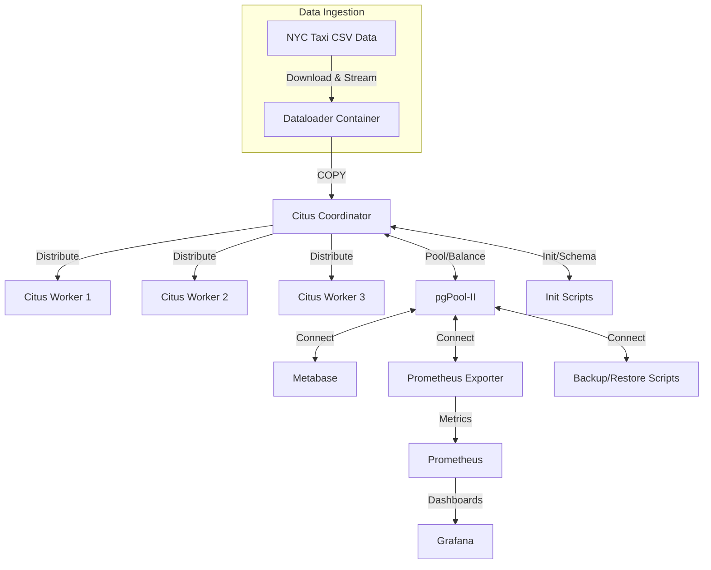

# Database System Platform for NYC Taxi Data Analytics

## 1. Introduction
This repository provides a robust, containerized Database System Platform for NYC Yellow Taxi trip data analytics, leveraging a distributed PostgreSQL cluster (Citus), connection pooling (pgPool-II), real-time ingestion, and modern BI/monitoring tools. The system is designed for high-throughput data loading, scalable analytics, and interactive dashboarding, suitable for advanced analytics, and scalable ready for production deployment.

Key features:
- Distributed SQL analytics with Citus/PostgreSQL
- Automated ingestion of large CSV datasets
- Materialized views for fast, complex aggregations
- Connection pooling and load balancing via pgPool-II
- End-to-end monitoring with Prometheus and Grafana
- Interactive dashboards with Metabase
- Fully orchestrated via Docker Compose

This platform is production-grade in architecture, but defaults to demo-scale settings. It can be extended for larger deployments, CI/CD, and security hardening.

---

## 2. Architecture
The system consists of the following major components:
- **Citus/PostgreSQL Cluster**: Distributed SQL database for scalable analytics
- **pgPool-II**: Connection pooling, load balancing, and failover
- **Metabase**: BI dashboarding and visualization
- **Prometheus & Grafana**: Monitoring and metrics
- **Dataloader**: Automated ingestion of NYC Yellow Taxi trip data
- **Backup/Restore Scripts**: Data protection and recovery

### Architectural Diagram



### Directory Structure
```
database-system/
├── .env                        # Environment variables (copy from .env.example)
├── .env.example                # Example env file
├── .gitignore                  # Git ignore file
├── docker-compose.yml          # Main orchestrator (all services)
├── ingest_yellow_taxi_data.py  # Legacy ingestion script (reference)
├── install-docker.sh           # Automated Docker + Compose install (Ubuntu)
├── README.md                   # Documentation
│
├── db/
│   ├── init/
│   │   ├── 01_create_users.sql
│   │   └── 02_create_schema.sql
│   └── pgpool/
│       └── pgpool.conf
│
├── monitoring/
│   ├── prometheus.yml
│   └── grafana/
│       ├── dashboards/
│       │   └── postgres_overview.json
│       └── provisioning/
│           ├── dashboards/
│           │   └── dashboard.yml
│           └── datasources/
│               └── prometheus.yml
│
├── analytics/
│   ├── materialized_views/
│   │   ├── dataloader_mv_execution.sql
│   │   ├── hourly_average_trip_duration.sql
│   │   ├── MoM_hourly_tips_change.sql
│   │   ├── QoQ_hourly_tips_change.sql
│   │   ├── taxy_density_per_square_km.sql
│   │   └── trips_per_day.sql
│   └── metabase/
│       ├── hourly_average_trip_duration.sql
│       ├── MoM_hourly_tips_change.sql
│       ├── QoQ_hourly_tips_change.sql
│       ├── taxy_density_per_square_km.sql
│       └── trips_per_day.sql
│
├── scripts/
│   ├── backup.sh               # Manual/cron backup script
│   ├── ingest_helper.py        # Helper for ingestion
│   ├── ingest_run.sh           # Ingestion runner
│   └── restore.sh              # Restore from backups
```

---

## 3. Installations & Prerequisites

### Docker & Docker Compose
Use `install-docker.sh` to install Docker Engine and Compose plugin on Ubuntu. The script also installs common utilities and configures your user for rootless Docker usage.

#### Usage
```bash
wget https://raw.githubusercontent.com/ellykadenyo/database-system/main/install-docker.sh
bash install-docker.sh
newgrp docker
docker run hello-world
```
**Note:** For non-Ubuntu systems, follow official Docker documentation.

### Environment Configuration
Copy `.env.example` to `.env` and fill in all required values for ports, database credentials, and service users. This file is critical for secure and correct operation.

---

## 4. Deployment & Usage

### Quick Start
1. **Clone the repository:**
   ```bash
   git clone https://github.com/ellykadenyo/database-system.git
   cd database-system
   ```
2. **Configure environment:**
   ```bash
   cp .env.example .env
   # Edit .env to set all required values
   ```
3. **Start the stack:**
   ```bash
   docker compose up -d
   ```
4. **Monitor logs:**
   ```bash
   docker compose logs -f
   ```
5. **Stop the stack:**
   ```bash
   docker compose down
   ```

### Service Endpoints
- **Metabase:**   `http://<host-ip>:${METABASE_PORT}`
- **Grafana:**    `http://<host-ip>:${GRAFANA_PORT}`
- **Prometheus:** `http://<host-ip>:${PROMETHEUS_PORT}`
- **Postgres/Citus Coordinator:** `postgresql://<host-ip>:${COORDINATOR_PORT}/tripdata`

## 5. System Details

### Data Ingestion
The system ingests NYC Yellow Taxi trip data from public sources using a dedicated dataloader container. Data is streamed and loaded into a distributed table (`yellow_tripdata`) in Citus/PostgreSQL using high-throughput `COPY` operations. The ingestion process is automated and robust, with error handling and logging.

### Database Schema & Initialization
Initialization scripts in `db/init/` create all required users, roles, and the main analytics table. The table is distributed across Citus workers for parallel query performance. Materialized views are created for key analytics use cases:
- Hourly average trip duration
- Month-over-month and quarter-over-quarter tips change
- Taxi density per square kilometer
- Trips per day

Privileges are set for ingestion, analytics, and monitoring users.

### Connection Pooling & Load Balancing
pgPool-II provides connection pooling, load balancing for read queries, and failover management. It is configured to route connections to the Citus coordinator and manage health checks.

### Monitoring & Observability

Prometheus scrapes metrics from the database and containers. Grafana provides dashboards for system health, query performance, and resource usage. The system includes ready-to-import dashboard templates.

#### Grafana Dashboard Screenshots

Below are sample screenshots from the Grafana dashboards:


### BI & Visualization

Metabase connects to the database via pgPool-II, enabling interactive dashboards and ad-hoc analytics. Materialized views are optimized for fast queries and visualization.

#### Metabase Dashboard Screenshots

Below are sample screenshots from the Metabase dashboards:


### Backup & Restore
Scripts in `scripts/` provide manual and automated backup/restore capabilities. These can be extended for cloud storage (e.g., S3) and scheduled operations.

## 6. Security & Best Practices
- All credentials and secrets are managed via `.env` (never commit `.env`)
- Database users have least-privilege access
- Connection pooling and health checks are enforced
- For production, enable TLS/SSL, RBAC, and regular backups

## 7. Extensibility & Customization
- Add new materialized views for custom analytics
- Integrate with CI/CD for automated deployments
- Extend monitoring with custom Grafana dashboards
- Scale out Citus workers for higher throughput
- Integrate cloud storage for backups

## 8. Troubleshooting & Support
- Check container logs for errors: `docker compose logs -f`
- Validate environment variables in `.env`
- Use Grafana and Prometheus for system health
- For database issues, connect to Citus coordinator and inspect tables/views

## 9. References
- [Citus Data Documentation](https://docs.citusdata.com/en/v13.0/)
- [PostgreSQL Documentation](https://www.postgresql.org/docs/)
- [pgPool-II Documentation](https://www.pgpool.net/docs/latest/en/html/)
- [Metabase Documentation](https://www.metabase.com/docs/)
- [Prometheus Documentation](https://prometheus.io/docs/)
- [Grafana Documentation](https://grafana.com/docs/)
