# Database System Platform for NYC Taxi Data Analytics

## 1. Introduction
This repository provides a robust, containerized Database System Platform for NYC Yellow Taxi trip data analytics, leveraging a distributed PostgreSQL cluster (Citus), connection pooling (pgPool-II), real-time ingestion, and modern BI/monitoring tools. The system is designed for high-throughput data loading, scalable analytics, and interactive dashboarding, suitable for advanced analytics, and scalable ready for production deployment.

Key features:
- Distributed SQL analytics with Citus/PostgreSQL
- Automated ingestion of large CSV datasets
- Materialized views for fast, complex aggregations
- Connection pooling and load balancing via pgPool-II
- End-to-end monitoring with Prometheus and Grafana
- Interactive dashboards with Metabase
- Fully orchestrated via Docker Compose

This platform is production-grade in architecture, but defaults to demo-scale settings. It can be extended for larger deployments, CI/CD, and security hardening.

---

## 2. Architecture
The system consists of the following major components:
- **Citus/PostgreSQL Cluster**: Distributed SQL database for scalable analytics
- **pgPool-II**: Connection pooling, load balancing, and failover
- **Metabase**: BI dashboarding and visualization
- **Prometheus & Grafana**: Monitoring and metrics
- **Dataloader**: Automated ingestion of NYC Yellow Taxi trip data
- **Backup/Restore Scripts**: Data protection and recovery

### Architectural Diagram

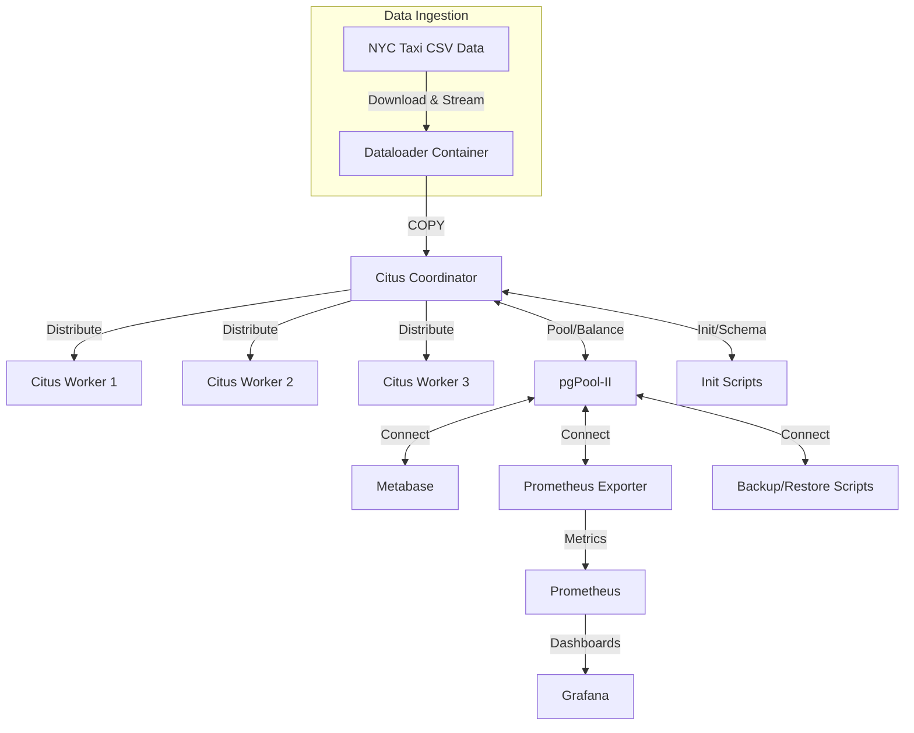

### Directory Structure
```
database-system/
├── .env                        # Environment variables (copy from .env.example)
├── .env.example                # Example env file
├── .gitignore                  # Git ignore file
├── docker-compose.yml          # Main orchestrator (all services)
├── ingest_yellow_taxi_data.py  # Legacy ingestion script (reference)
├── install-docker.sh           # Automated Docker + Compose install (Ubuntu)
├── README.md                   # Documentation
│
├── db/
│   ├── init/
│   │   ├── 01_create_users.sql
│   │   └── 02_create_schema.sql
│   └── pgpool/
│       └── pgpool.conf
│
├── monitoring/
│   ├── prometheus.yml
│   └── grafana/
│       ├── dashboards/
│       │   └── postgres_overview.json
│       └── provisioning/
│           ├── dashboards/
│           │   └── dashboard.yml
│           └── datasources/
│               └── prometheus.yml
│
├── analytics/
│   ├── materialized_views/
│   │   ├── dataloader_mv_execution.sql
│   │   ├── hourly_average_trip_duration.sql
│   │   ├── MoM_hourly_tips_change.sql
│   │   ├── QoQ_hourly_tips_change.sql
│   │   ├── taxy_density_per_square_km.sql
│   │   └── trips_per_day.sql
│   └── metabase/
│       ├── hourly_average_trip_duration.sql
│       ├── MoM_hourly_tips_change.sql
│       ├── QoQ_hourly_tips_change.sql
│       ├── taxy_density_per_square_km.sql
│       └── trips_per_day.sql
│
├── scripts/
│   ├── backup.sh               # Manual/cron backup script
│   ├── ingest_helper.py        # Helper for ingestion
│   ├── ingest_run.sh           # Ingestion runner
│   └── restore.sh              # Restore from backups
```

---

## 3. Installations & Prerequisites

### Docker & Docker Compose
Use `install-docker.sh` to install Docker Engine and Compose plugin on Ubuntu. The script also installs common utilities and configures your user for rootless Docker usage.

#### Usage
```bash
wget https://raw.githubusercontent.com/ellykadenyo/database-system/main/install-docker.sh
bash install-docker.sh
newgrp docker
docker run hello-world
```
**Note:** For non-Ubuntu systems, follow official Docker documentation.

### Environment Configuration
Copy `.env.example` to `.env` and fill in all required values for ports, database credentials, and service users. This file is critical for secure and correct operation.

---

## 4. Deployment & Usage

### Quick Start
1. **Clone the repository:**
   ```bash
   git clone https://github.com/ellykadenyo/database-system.git
   cd database-system
   ```
2. **Configure environment:**
   ```bash
   cp .env.example .env
   # Edit .env to set all required values
   ```
3. **Start the stack:**
   ```bash
   docker compose up -d
   ```
4. **Monitor logs:**
   ```bash
   docker compose logs -f
   ```
5. **Stop the stack:**
   ```bash
   docker compose down
   ```

### Service Endpoints
- **Metabase:**   `http://<host-ip>:${METABASE_PORT}`
- **Grafana:**    `http://<host-ip>:${GRAFANA_PORT}`
- **Prometheus:** `http://<host-ip>:${PROMETHEUS_PORT}`
- **Postgres/Citus Coordinator:** `postgresql://<host-ip>:${COORDINATOR_PORT}/tripdata`

## 5. System Details

### Data Ingestion
The system ingests NYC Yellow Taxi trip data from public sources using a dedicated dataloader container. Data is streamed and loaded into a distributed table (`yellow_tripdata`) in Citus/PostgreSQL using high-throughput `COPY` operations. The ingestion process is automated and robust, with error handling and logging.

### Database Schema & Initialization
Initialization scripts in `db/init/` create all required users, roles, and the main analytics table. The table is distributed across Citus workers for parallel query performance. Materialized views are created for key analytics use cases:
- Hourly average trip duration
- Month-over-month and quarter-over-quarter tips change
- Taxi density per square kilometer
- Trips per day

Privileges are set for ingestion, analytics, and monitoring users.

### Connection Pooling & Load Balancing
pgPool-II provides connection pooling, load balancing for read queries, and failover management. It is configured to route connections to the Citus coordinator and manage health checks.

### Monitoring & Observability

Prometheus scrapes metrics from the database and containers. Grafana provides dashboards for system health, query performance, and resource usage. The system includes ready-to-import dashboard templates.

#### Grafana Dashboard Screenshots

Below are sample screenshots from the Grafana dashboards:

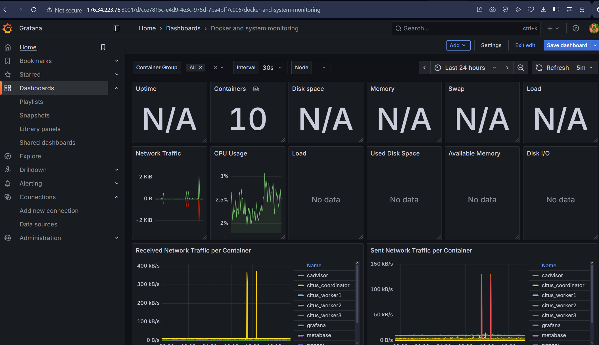
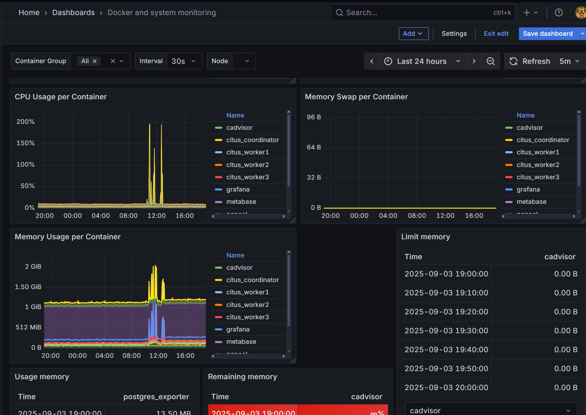
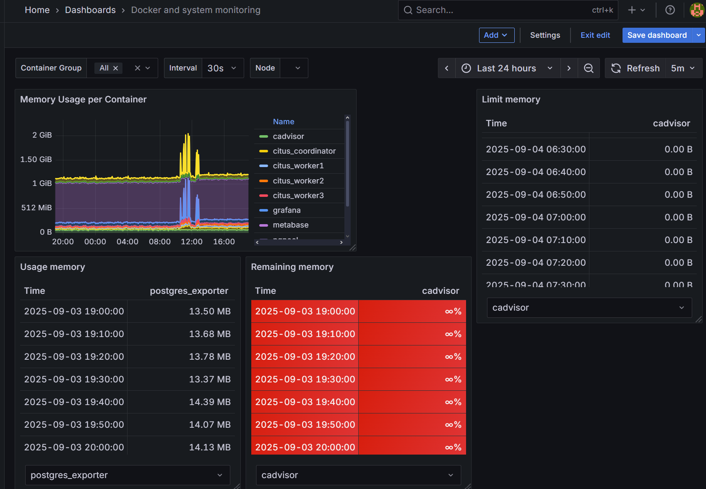
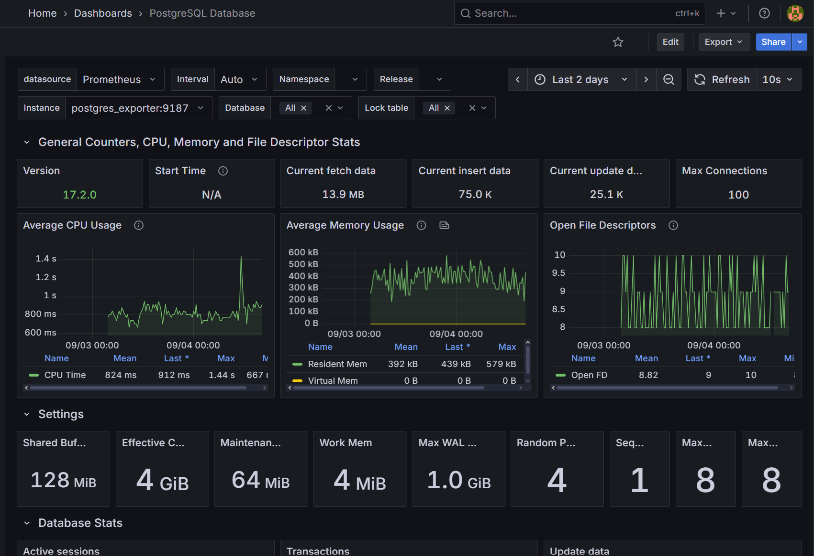
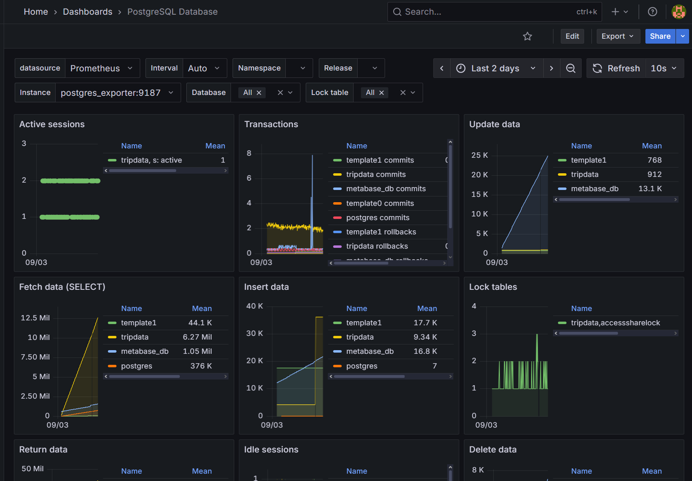
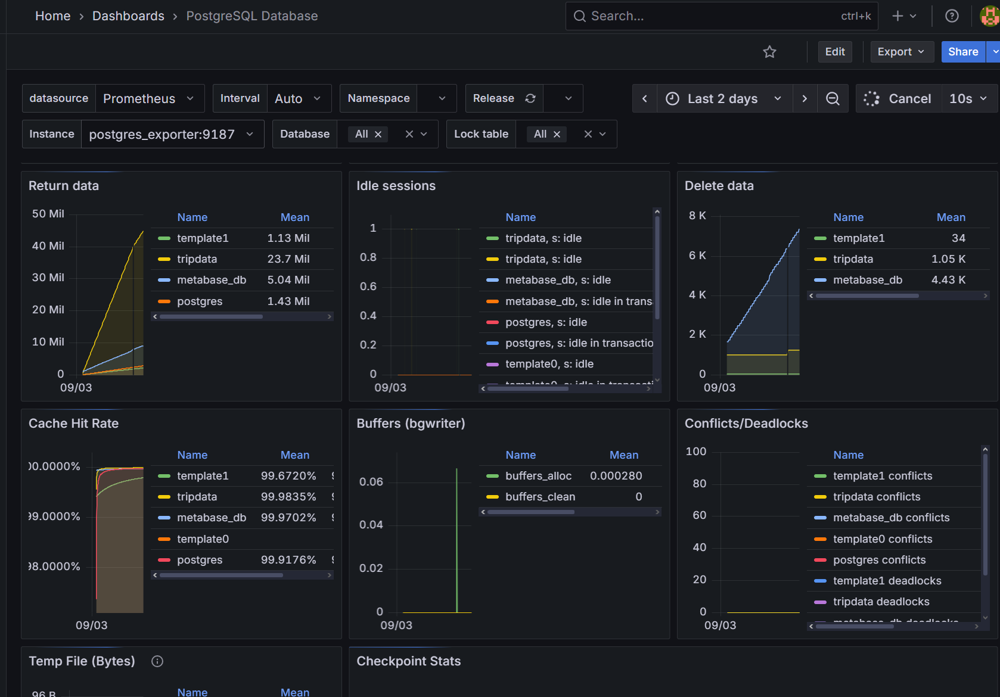
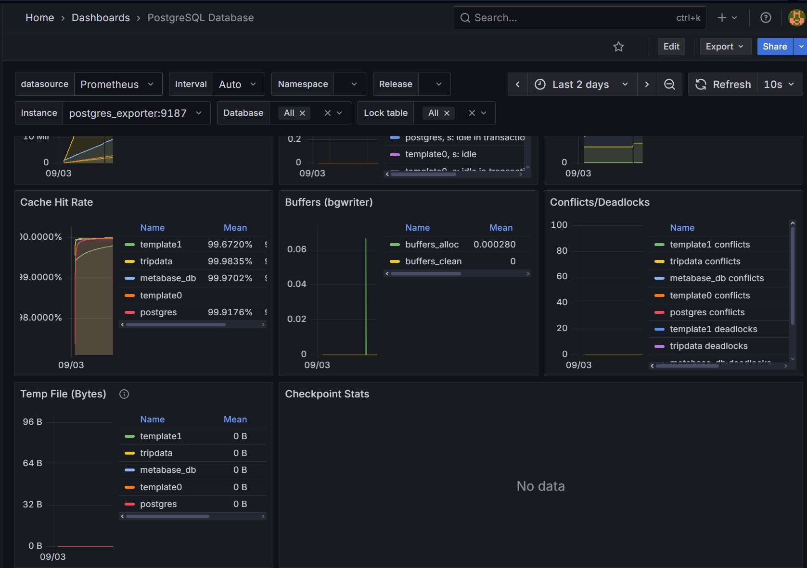

### BI & Visualization

Metabase connects to the database via pgPool-II, enabling interactive dashboards and ad-hoc analytics. Materialized views are optimized for fast queries and visualization.

#### Metabase Dashboard Screenshots

Below are sample screenshots from the Metabase dashboards:

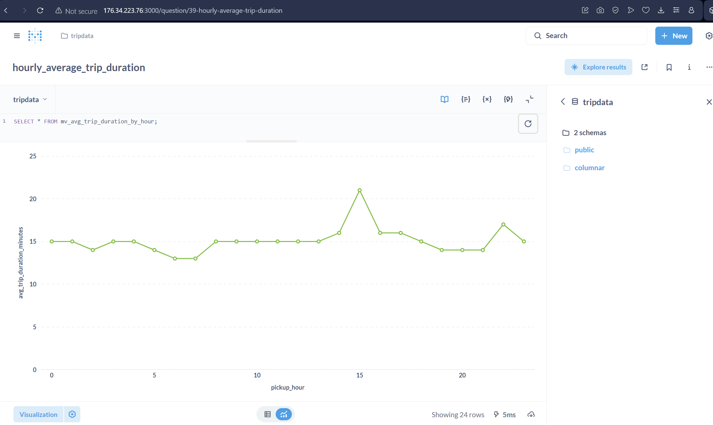
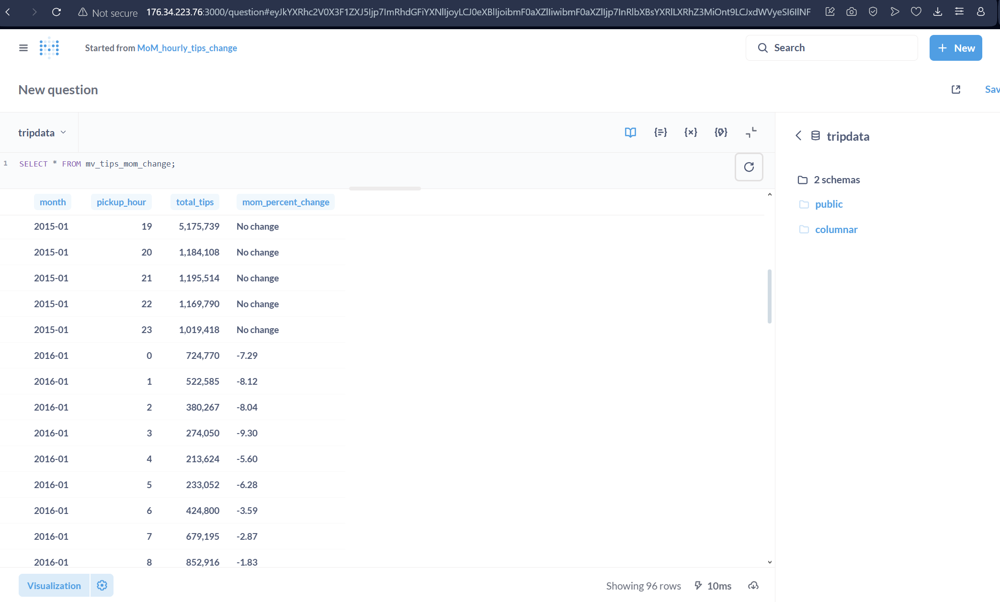
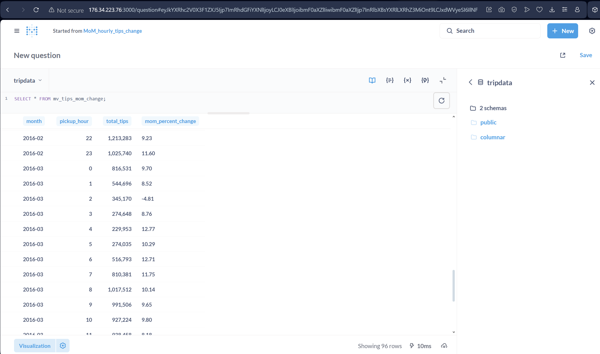
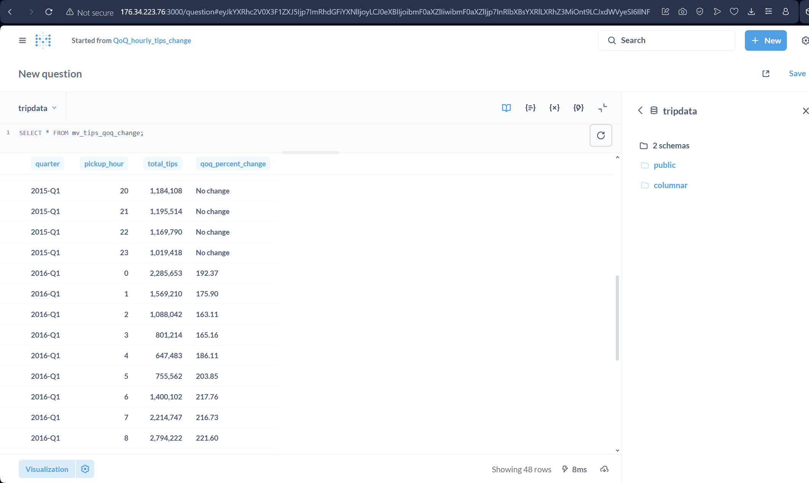
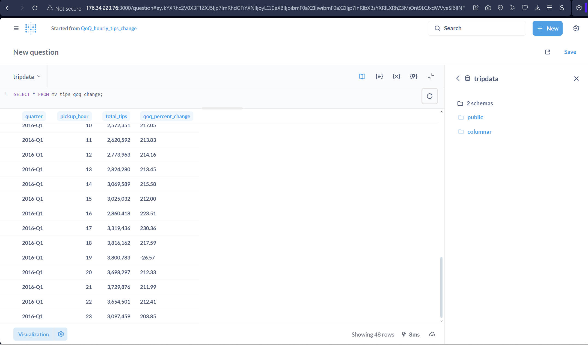
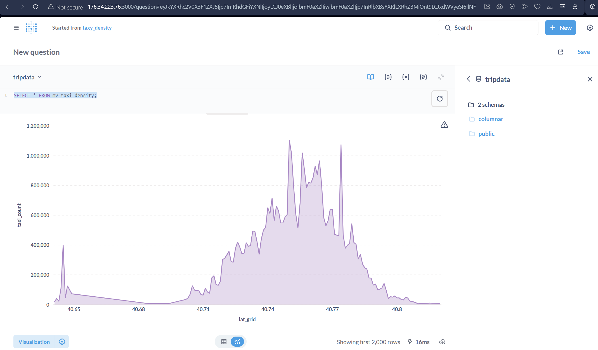
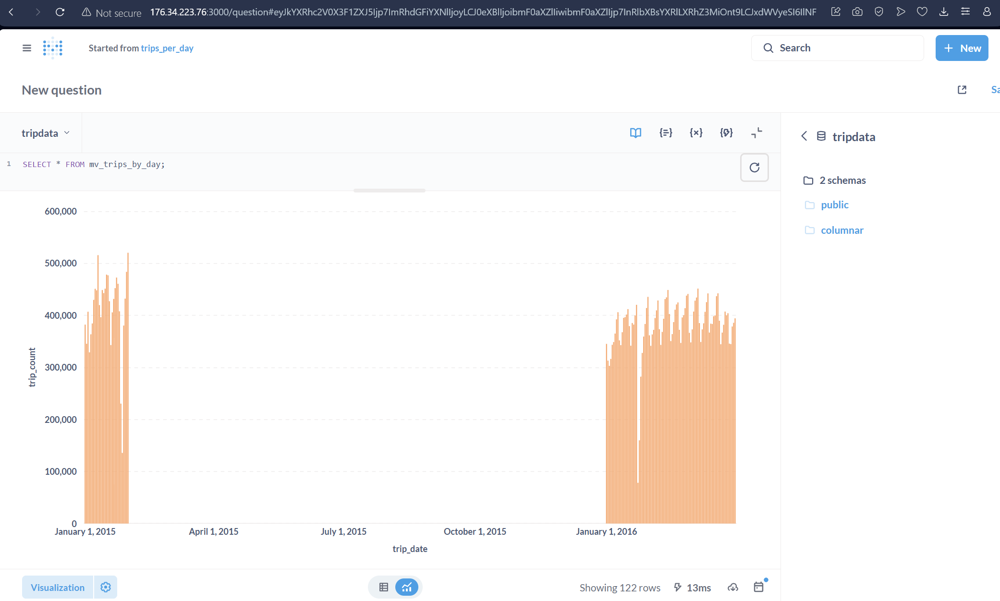

### Backup & Restore
Scripts in `scripts/` provide manual and automated backup/restore capabilities. These can be extended for cloud storage (e.g., S3) and scheduled operations.

## 6. Security & Best Practices
- All credentials and secrets are managed via `.env` (never commit `.env`)
- Database users have least-privilege access
- Connection pooling and health checks are enforced

## 7. Scalability & Customization for Production Deployment

Achieving ultra-high throughput (over 1 million inserts per second) and robust, production-grade analytics requires architectural, operational, and security enhancements. Below is a roadmap and best practices for scaling this platform:

### 1. High-Throughput Real-Time Ingestion & Streaming Integration
- **Streaming Source Integration:** Use Apache Kafka (or Pulsar) as the central streaming platform for ingesting real-time data. Kafka topics can buffer and distribute events to multiple consumers for parallel processing.
- **Kafka Connectors & Microservices:** Deploy ingestion microservices or Kafka Connect connectors that consume from Kafka and write to the database using batch COPY or streaming inserts. This decouples producers from consumers and enables scalable, fault-tolerant ingestion.
- **Batch & Streaming:** Combine batch COPY for bulk loads with streaming inserts for real-time data. Use partitioned tables and write-optimized schemas.
- **Distributed Ingestion:** Use multiple ingestion nodes (containers or VMs) to parallelize data loading from Kafka and other sources.
- **Connection Pooling:** Increase pgPool-II and database connection pool sizes. Use load balancers to distribute ingestion traffic.
- **Table Partitioning:** Partition tables by time (e.g., daily/hourly) and/or hash for parallel writes and efficient pruning.
- **Citus Sharding:** Scale out Citus workers horizontally. Each worker handles a shard, enabling parallel inserts and queries.
- **Bulk Insert APIs:** Use COPY, UNLOGGED tables, and deferred constraints for fastest ingestion. For streaming, use async drivers and batching.

### 2. OLTP vs OLAP Workload Separation
- **OLTP (Online Transaction Processing):** Handle transactional workloads (e.g., inserts, updates, deletes, point lookups) on dedicated Citus/Postgres clusters optimized for write throughput and low latency. Use connection pooling, partitioning, and sharding for scale.
- **OLAP (Online Analytical Processing):** Offload analytical queries (aggregations, reporting, dashboarding) to separate clusters or replicas. Use read replicas, columnar extensions (e.g., Citus columnar, ClickHouse), or federated query engines. Analytical workloads can be isolated from transactional workloads to prevent resource contention.
- **Data Sync:** Use logical replication, Change Data Capture (CDC), or ETL pipelines to keep OLAP clusters in sync with OLTP sources. Kafka can serve as the backbone for CDC and event-driven data movement.
- **Query Routing:** Use BI tools and analytics platforms to route heavy queries to OLAP endpoints, while apps use OLTP endpoints for transactional access.

### 3. Flexible Data Access & Filtering
- **Indexing:** Create indexes on frequently filtered columns (e.g., time, location, user/app fields).
- **Materialized Views:** Precompute aggregates and filtered views for fast access.
- **Role-Based Access Control (RBAC):** Use Postgres roles and row-level security to restrict data access by user/app.

### 4. Long-Term Data Retention & Archival
- **Partition Pruning:** Use time-based partitions for efficient retention and archiving.
- **Cold Storage:** Move older partitions to cloud object storage (S3, GCS) or data lake solutions. Use foreign data wrappers for query federation.
- **Automated Archival:** Schedule jobs to archive and purge data based on retention policies.

### 5. Aggregated Statistics & Analytics
- **Materialized Views:** Create and refresh views for aggregates (e.g., hourly, daily, monthly stats).
- **OLAP Extensions:** Integrate with columnar stores (e.g., ClickHouse, Apache Druid) for advanced analytics if needed.
- **BI Tools:** Connect Metabase, Grafana, or enterprise BI platforms for interactive analytics.

### 6. Production-Ready Architecture (OLTP/OLAP Separation & Streaming)

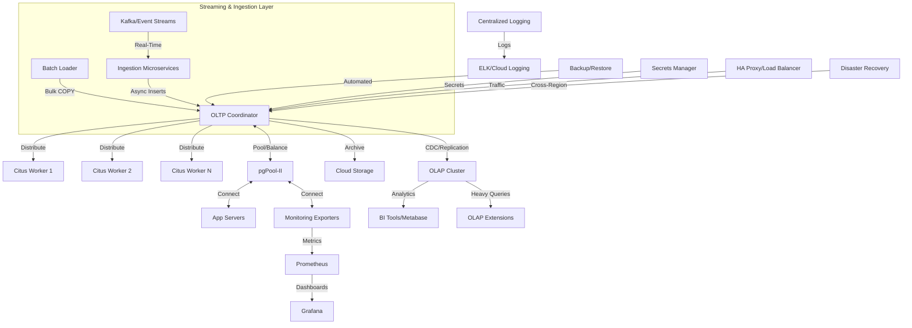

### 7. Security, HA, and Disaster Recovery
- **Encryption:** Enable TLS for all connections (Postgres, pgPool-II, BI tools). Encrypt data at rest using disk or cloud encryption.
- **Secret Management:** Store credentials in a secrets manager (Vault, AWS Secrets Manager, Azure Key Vault).
- **High Availability:** Deploy Citus coordinator and workers in HA mode (multiple replicas, failover). Use load balancers (HAProxy, cloud LB) for traffic routing.
- **Disaster Recovery:** Implement cross-region replication, PITR (Point-In-Time Recovery), and regular backups. Test restore procedures.
- **Automated Backups:** Schedule full and incremental backups. Store in multiple locations (cloud, on-prem).
- **Centralized Logging:** Aggregate logs from all containers/services to ELK, Loki, or cloud logging platforms. Enable alerting for errors and anomalies.
- **Monitoring & Alerting:** Use Prometheus and Grafana for metrics, with alerting rules for failures, slow queries, and resource exhaustion.

### 8. Performance Tuning
- **Partitioning:** Use native Postgres partitioning for large tables. Prune partitions for queries and retention.
- **Sharding:** Increase number of Citus shards and workers for parallelism.
- **Connection Pools:** Tune pgPool-II and application pools for concurrency.
- **Resource Sizing:** Allocate sufficient CPU, RAM, and fast storage (NVMe, SSD) for ingestion and query workloads.
- **Query Optimization:** Analyze and tune queries, create appropriate indexes, and use EXPLAIN plans.

### 9. Automation & DevOps
- **CI/CD:** Automate deployments, schema migrations, and configuration changes.
- **Infrastructure as Code:** Use Terraform, Ansible, or cloud-native tools for reproducible infrastructure.
- **Health Checks:** Automate service health checks and self-healing.

### 10. Path to Full-Scale Solution
1. **Start with the provided Docker Compose stack for prototyping.**
2. **Move to Kubernetes or cloud-native orchestration for scaling.**
3. **Integrate streaming ingestion and batch loaders using Kafka.**
4. **Separate OLTP and OLAP workloads with dedicated clusters and replication.**
5. **Scale out Citus workers and shards.**
6. **Implement HA, DR, and security best practices.**
7. **Automate monitoring, alerting, and backups.**
8. **Continuously tune performance and cost.**

## 8. Troubleshooting & Support
- Check container logs for errors: `docker compose logs -f`
- Validate environment variables in `.env`
- Use Grafana and Prometheus for system health
- For database issues, connect to Citus coordinator and inspect tables/views

## 9. References

- [Citus Data Documentation](https://docs.citusdata.com/en/v13.0/)
- [PostgreSQL Documentation](https://www.postgresql.org/docs/)
- [pgPool-II Documentation](https://www.pgpool.net/docs/latest/en/html/)
- [Metabase Documentation](https://www.metabase.com/docs/)
- [Prometheus Documentation](https://prometheus.io/docs/)
- [Grafana Documentation](https://grafana.com/docs/)

## 10. Exercise Reflection

### 1. Most Interesting
The scope of this exercise (Kind of full stack data engineering) was challening and interesting because I was able to apply quite a range of my data engineering skills from data platform architecting, deployment automation, containerization, SQL, dashboarding, monitoring etc.

### 2. Most Cumbersome
Won't term it cumbersome but testing the Materialized Views took a bit of time because each time I had to REFRESH them by reloading them with data afresh and considering the small capability of the AWS EC2 server I was using it took bit of time.
